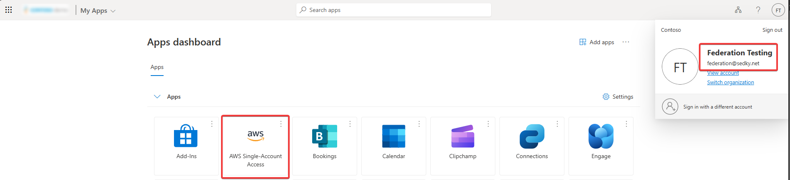
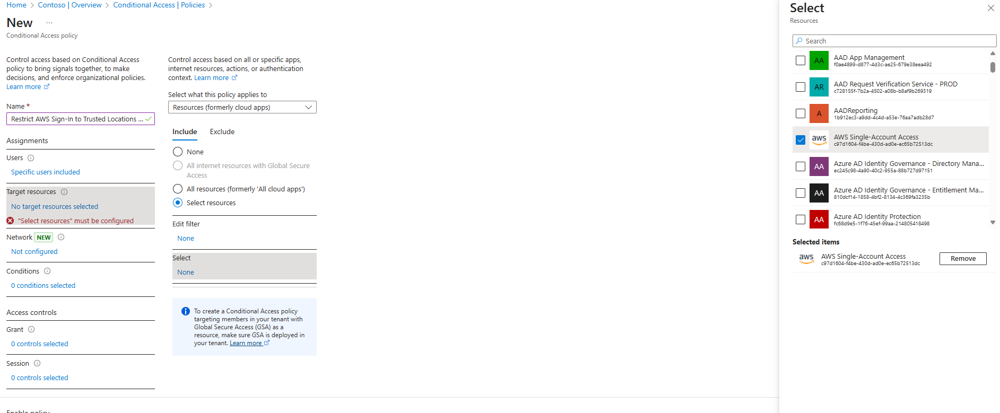
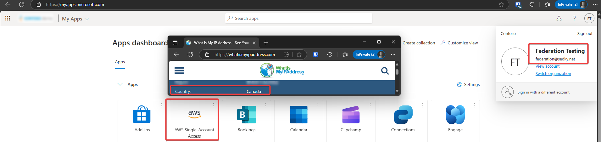
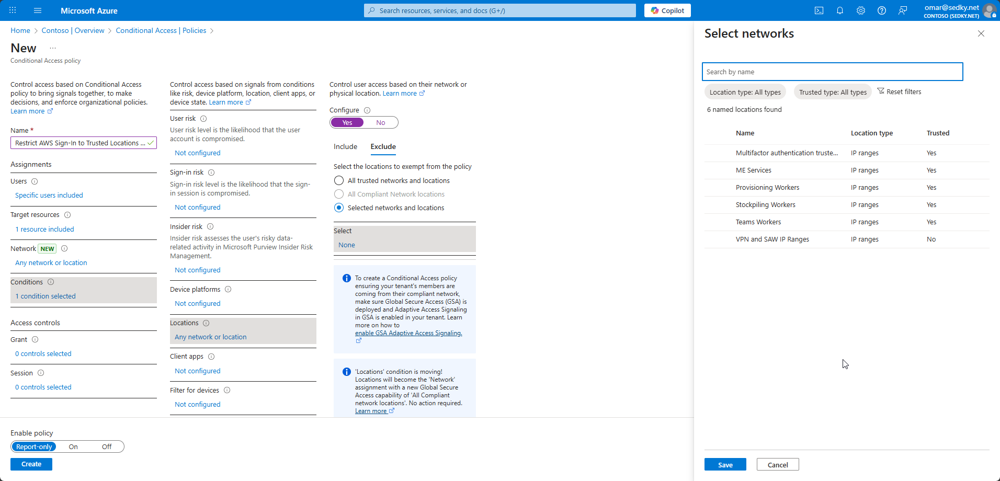

# Enterprise-Grade SAML Federation to AWS Using Microsoft Entra ID & Conditional Access

This project implements secure single sign-on (SSO) to the AWS Console using Microsoft Entra ID (formerly Azure AD) as a SAML 2.0 Identity Provider. The setup enforces Multi-Factor Authentication (MFA), Conditional Access policies based on geolocation (Canada), and maps Entra security groups to AWS IAM roles.

This is a real-world, enterprise-grade identity federation example aligned with the AWS Well-Architected Framework — designed to reduce credential sprawl, enforce compliance, and enable full auditability of federated login workflows.

---

## 🧭 Architecture Overview

This solution integrates Microsoft Entra ID with AWS IAM using a SAML 2.0 trust relationship. Key capabilities include:

- **SAML 2.0 Federation** from Microsoft Entra ID to AWS
- **IAM roles** mapped to Entra groups via SAML attribute mappings
- **Conditional Access** enforcing MFA and trusted IP locations (Canada)
- **Audit logs** from both AWS and Entra ID portals


---

## ✅ Business Impact

- ✅ Eliminates long-term IAM access keys  
- ✅ Enables centralized user provisioning and deprovisioning  
- ✅ Reduces operational overhead via group-based role management  
- ✅ Satisfies enterprise compliance and security baselines  
- ✅ Increases login transparency through conditional policies and logs

---

## 🔐 Conditional Access Policy Configuration

| Feature           | Configuration                       |
|------------------|-------------------------------------|
| Assigned Group   | `AWS-Users`                         |
| Targeted App     | AWS Enterprise Application          |
| Grant Controls   | Require MFA, Require Trusted Location |
| Named Location   | Canadian IP address ranges          |

---

## ⚙️ IAM Trust Policy Example

```json
{
  "Version": "2012-10-17",
  "Statement": [
    {
      "Effect": "Allow",
      "Principal": {
        "Federated": "arn:aws:iam::ACCOUNT_ID:saml-provider/entra-saml"
      },
      "Action": "sts:AssumeRoleWithSAML",
      "Condition": {
        "StringEquals": {
          "SAML:aud": "https://signin.aws.amazon.com/saml",
          "SAML:groups": "AWS-Users"
        }
      }
    }
  ]
}

---

🖼️ UI Preview

| Screenshot                                            | Description                        |
| ----------------------------------------------------- | ---------------------------------- |
|            | Entra portal SSO access to AWS     |
|  | Federated user in AWS Console      |
|     | Blocked login from outside Canada  |
|         | Audit log showing successful login |
|         | Audit log showing blocked login    |

---

🧱 Well-Architected Framework Alignment

| Pillar                     | Design Decision                                                             |
| -------------------------- | --------------------------------------------------------------------------- |
| **Security**               | MFA enforcement, short-term credentials, least-privilege access with groups |
| **Reliability**            | Federation enables centralized identity management across platforms         |
| **Operational Excellence** | Simplifies access workflows and improves visibility                         |
| **Cost Optimization**      | Reduces time spent managing IAM users and credentials                       |
| **Performance Efficiency** | Scales securely with growing organization through group policies            |

---

## 📂 Project Structure

Project-01-Federation-AWS-M365/
│
├── Metadata/
│   └── aws-saml-idp.xml
│
├── Screenshots/
│   └── [23 PNG images]
│
├── saml-federation.html
├── README.md
├── LICENSE

---

📘 Full Documentation
➡ View Complete Implementation Guide (saml-federation.html)

---

## 📬 Contact

- LinkedIn: [Omar Sedky](https://www.linkedin.com/in/omarsedky)
- GitHub: [@oSedky](https://github.com/oSedky)
- Email: omar@sedky.net