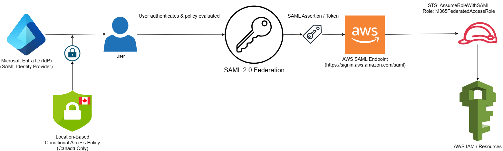

# Enterprise-Grade SAML Federation to AWS Using Microsoft Entra ID & Conditional Access

This project implements secure single sign-on (SSO) to the AWS Console using Microsoft Entra ID (formerly Azure AD) as a SAML 2.0 Identity Provider. The setup enforces Multi-Factor Authentication (MFA), Conditional Access policies based on geolocation (Canada), and maps Entra groups to AWS IAM roles.

This real-world, enterprise-grade identity federation example aligns with the AWS Well-Architected Framework and is designed to reduce credential sprawl, enforce compliance, and enable full auditability of federated login sessions.

---

## 🧭 Architecture Overview

This solution integrates Microsoft Entra ID with AWS IAM using a SAML 2.0 trust relationship. Key capabilities include:

- ✅ **SAML 2.0 Federation** from Microsoft Entra ID to AWS  
- ✅ **IAM Roles mapped** to Entra groups via SAML attribute mappings  
- ✅ **Conditional Access** enforcing MFA and trusted IP locations (Canada)  
- ✅ **Audit logs** from both AWS and Entra ID portals



---

## 💼 Business Impact

- ✅ Eliminates long-term IAM access keys  
- ✅ Enables centralized user provisioning and deprovisioning  
- ✅ Reduces operational overhead via group-based role management  
- ✅ Satisfies enterprise compliance and security baselines  
- ✅ Increases login transparency through conditional policies and logs  

---

## 🔐 Conditional Access Policy Configuration

| Feature          | Configuration                 |
|------------------|-------------------------------|
| Assigned Group   | AWS-Users                     |
| Targeted App     | AWS Enterprise Application    |
| Grant Controls   | Require MFA, Require Trusted Location |
| Named Location   | Canadian IP address ranges    |

---

## 🛡 IAM Trust Policy Example

```json
{
  "Version": "2012-10-17",
  "Statement": [
    {
      "Effect": "Allow",
      "Principal": {
        "Federated": "arn:aws:iam::<ACCOUNT_ID>:saml-provider/entra-saml"
      },
      "Action": "sts:AssumeRoleWithSAML",
      "Condition": {
        "StringEquals": {
          "SAML:aud": "https://signin.aws.amazon.com/saml"
        }
      }
    }
  ]
}
```

---

## 🖼 Screenshot Previews

| Screenshot                                     | Description                            |
|-----------------------------------------------|----------------------------------------|
| 01-user-creation-federation-sedky-net.png      | Entra portal user setup for AWS access |
| 12-entra-user-app-assignment.png              | Assigned app to user (Canada IP only)  |
| 17-login-blocked-non-canada.png               | Blocked login from outside Canada      |
| 13-sso-login-success.png                      | SSO to AWS Console (success)           |
| 19-sign-in-logs-blocked.png                   | Audit log showing blocked login        |

---

## ✅ AWS Well-Architected Framework Alignment

| Pillar        | Decision Justification |
|---------------|------------------------|
| **Security**  | No credentials in AWS, least-privilege access via groups |
| **Operational Excellence** | Central identity & session visibility |
| **Reliability** | Resilient login via identity federation |
| **Cost Optimization** | IAM roles scale without per-user management |
| **Performance Efficiency** | Seamless SSO experience |

---

## 📁 Project Structure

```
Project-01-Federation-AWS-M365/
├── Screenshots/
├── Metadata/aws-saml-idp.xml
├── saml-federation.html
├── LICENSE
├── README.md
```

---

## 📘 Full Documentation

👉 [Read the full implementation walkthrough on sedky.net](https://sedky.net/project1-saml-federation.html)

---

## 📬 Contact

- [LinkedIn – Omar Sedky](https://www.linkedin.com/in/omarsedky)  
- [GitHub – @oSedky](https://github.com/oSedky)  
- 📧 omar@sedky.net
